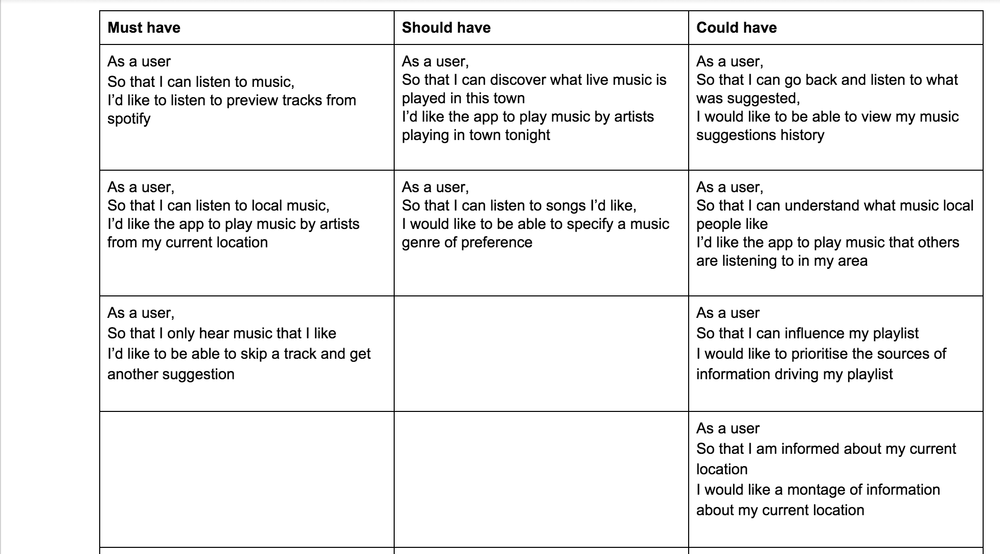
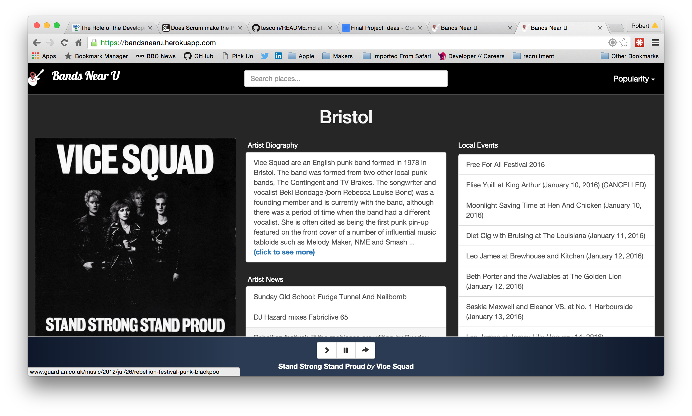
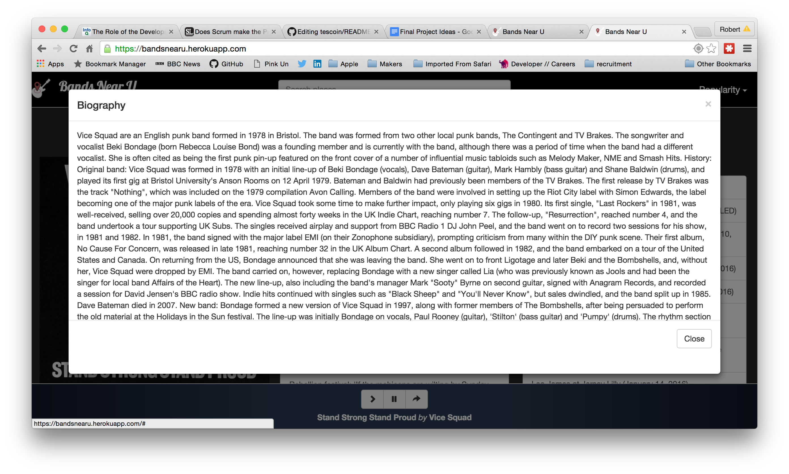
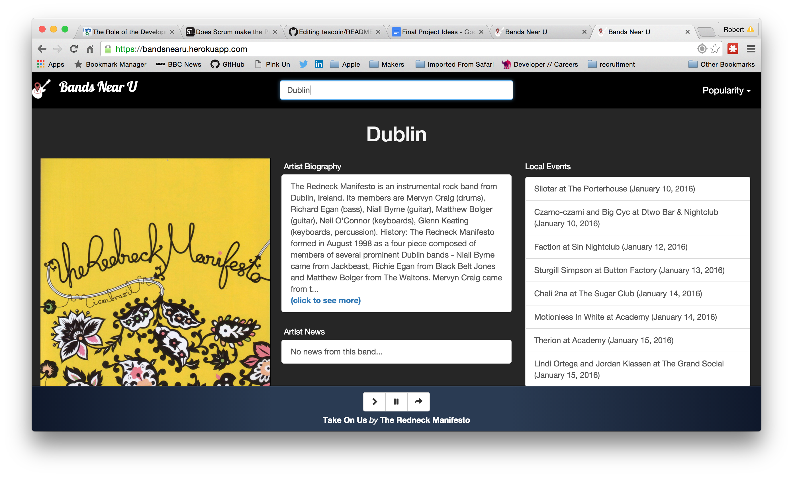
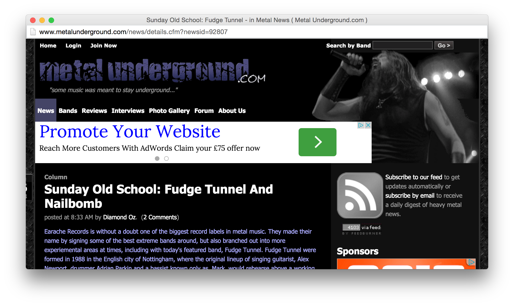
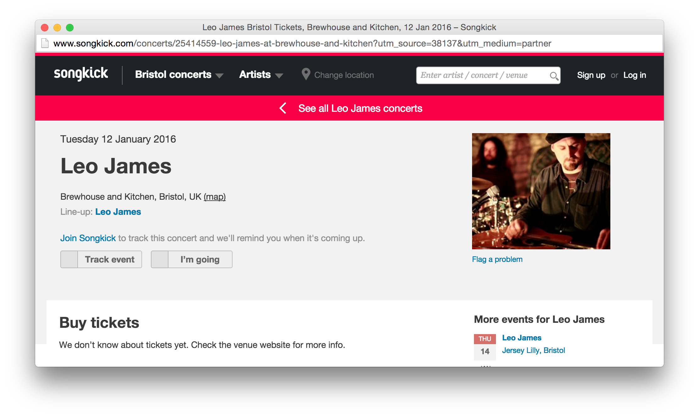
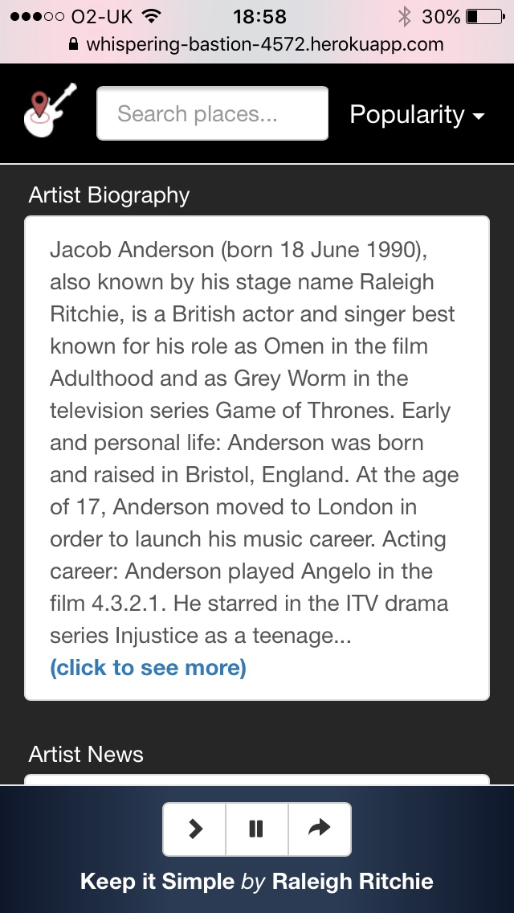
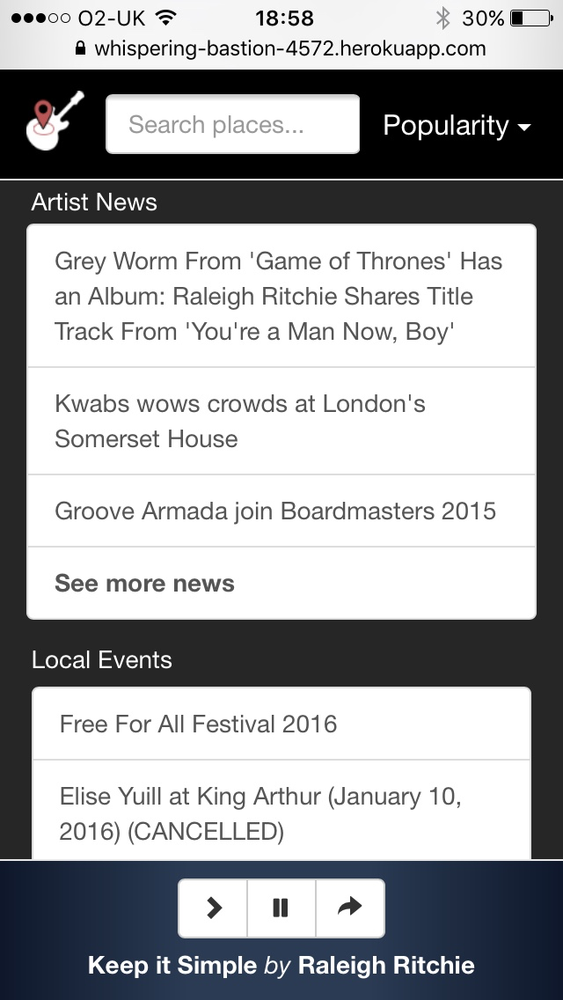
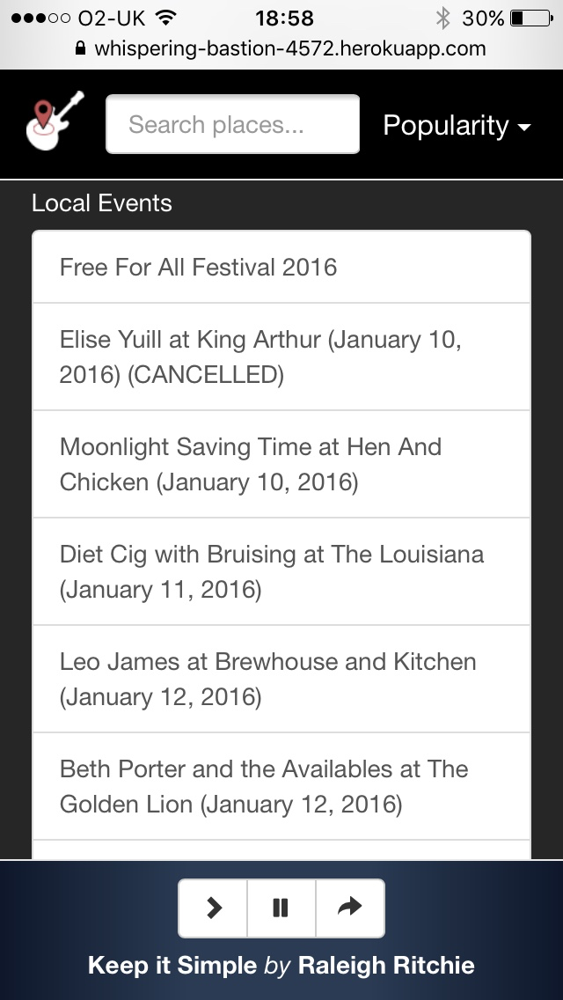

# Bands Near U

### User Stories


### Screenshots


















### Deployment locally
* Install Node/NPM
* Clone this project
* npm install from within the project directory
* *bower install
* open index.html

### Deploying to Heroku
* heroku create <you app name>
* git push heroku master
* heroku open

### Technologies used
* HTML
* javaScript
* jQuery
* jPlayer
* CSS3
* Bootstrap
* Google Maps API
* Echo Nest API
* Spotify API
* Songkick API

### Project Working Document
https://docs.google.com/document/d/16NNmJa4yp-4q5cYy07H9eRYgip4YFweZ9PlP4LGgvjY

### First week Retrospective
https://docs.google.com/document/d/1PymRPDJkgK5D5HhTtilmV6tAKLntoazEezHT0CInLKI

Retro:
Wednesday & Friday at 2.30pm

### Git Flow

``` Master ```  *Develop branch to be fully tested before merge into master. True consensus reached before push.*

``` Develop ```  *Always pull from Develop and test/fix issues before pushing.*

``` Features ```  *New feature branches to be deleted once merged into Develop.*


